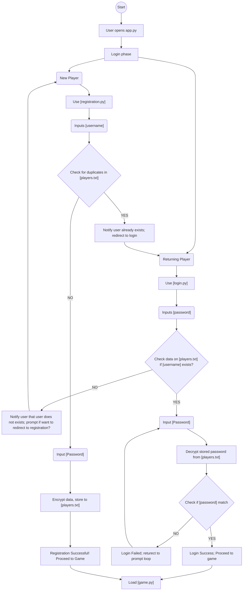

# eleven-mastermind
CSMC 202 Group 11 Project

## Algorithm

### PHASE 1: Login/Registration Management

```mermaid
graph TD
n1(("Start")) --> n2["User opens app.py"]
n2["User opens app.py"] --> n3["Login phase"]
n3["Login phase"] --> n4("New Player")
n3["Login phase"] --> n5("Returning Player")
n4("New Player") --> n6["Use [registration.py]"]
n5("Returning Player") --> n7["Use [login.py]"]
n6["Use [registration.py]"] --> n8("Inputs [username]")
n8("Inputs [username]") --> n9{"Check for duplicates in [players.txt]"}
n9 -- NO --> n10("Input [Password]")
n9 -- YES --> n11["Notify user already exists; redirect to login"]
n11["Notify user already exists; redirect to login"] --> n5
n7["Use [login.py]"] --> n12("Inputs [password]")
n12("Inputs [password]") --> n13{"Check data on [players.txt] if [username] exists?"}
n13 -- NO --> n14["Notify user that user does not exists; prompt if want to redirect to registration?"]
n13 -- YES --> n15("Input [Password]")
n14["Notify user that user does not exists; prompt if want to redirect to registration?"] --> n4
n15("Input [Password]") --> n16["Decrypt stored password from [players.txt]"]
n10("Input [Password]") --> n17["Encrypt data, store to [players.txt]"]
n16["Decrypt stored password from [players.txt]"] --> n18{"Check if [password] match"}
n18 -- YES --> n19["Login Success; Proceed to game"]
n18 -- NO --> n20["Login Failed; returect to prompt loop"]
n20["Login Failed; returect to prompt loop"] --> n15
n17["Encrypt data, store to [players.txt]"] --> n21["Registration Successful! Proceed to Game"]
n19["Login Success; Proceed to game"] --> n22["Load [game.py]"]
n21["Registration Successful! Proceed to Game"] --> n22["Load [game.py]"]
```